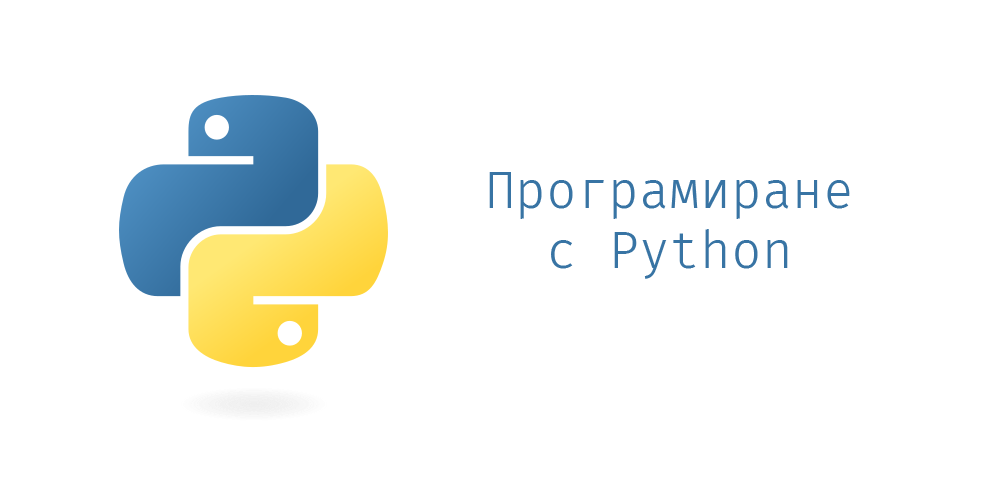

# Курс "Програмиране с Python" 2025

Github repository към курса "Програмиране с Python" във ФМИ

## Контакти

Влезте в нашия **Discord сървър**: *invite link TBA*
<!--  -->

Имаме за всеки случай и общ **email**: pythoncoursefmi@gmail.com (предпочитаме да не се пише до отделен преподавател)

## Провеждане

- TBA
- TBA

### Лекции

Всички лекции са събрани под формата на Jupyter notebook интерактивни записки.

JupyterBook "книжка" с всички теми има тук: https://fmipython.github.io/PythonCourse2025

| Тема номер | Тема                                                                                                                | Дата                   | Лектор                                                                                                                                                                  |
| ---------- | ------------------------------------------------------------------------------------------------------------------- | ---------------------- | ----------------------------------------------------------------------------------------------------------------------------------------------------------------------- |
| 0          | [Въведение към курса](./00%20-%20Course%20intro/)                                                                   | 06.10.2025 (1-ви час)  | [Любо](https://github.com/lyubolp) & [Алекс И.](https://github.com/yalishanda42) & [Сашо К.](https://github.com/Bladwark) |
| 1          | [Въведение в Python: какво е Python, настройка на средата, как да пуснем лекциите](./01%20-%20Intro%20to%20Python/) | 06.10.2025 (2-ри час)  | [Любо](https://github.com/lyubolp) & [Алекс И.](https://github.com/yalishanda42) & [Сашо К.](https://github.com/Bladwark) |
| 2          | [Основи: променливи, типове, разклонения, цикли, функции](./02%20-%20Variables,%20types,%20control%20flow/)         | 09.10.2025, 13.10.2025 | [Алекс](https://github.com/yalishanda42)                                                                                  |
| 3          | [Обектно-ориентирано програмиране в Python](./03%20-%20OOP/)                                                        | 16.10.2025, 20.10.2025 | [Алекс](https://github.com/yalishanda42)                                                                                                                                |
| 4          | [Функционално програмиране в Python](./04%20-%20Functional%20Programming/)                                          | 23.10.2025, 27.10.2025 | [Любо](https://github.com/lyubolp)                                                                                                                                      |
| 5          | [Представяне на структури от данни и алгоритми над тях](./05%20-%20Data%20Structures%20and%20Oddities/)             | 30.10.2025, 03.11.2025 | [Любо](https://github.com/lyubolp)                                                                                                                                      |
| 6          | [Тype hints (типови анотации)](./06%20-%20Typing%20Hints/)                                                          | 10.11.2025             | [Алекс](https://github.com/yalishanda42)                                                                                                                                |
| 7          | [Грешки и изключения](./07%20-%20Exceptions%20Handling/)                                                            | 13.11.2025             | [Алекс](https://github.com/yalishanda42)                                                                                                                                |
| 8          | [Работа с файлове](./08%20-%20Files/)                                                                               | 17.11.2025             | [Любо](https://github.com/lyubolp)                                                                                                                                      |
| 9          | [Многонишково и асинхронно програмиране](./09%20-%20Multithreading/)                                                | 20.11.2025             | [Любо](https://github.com/lyubolp)                                                                                                                                      |
| 10         | [Работа с HTTP заявки](./10%20-%20requests/)                                                                        | 24.11.2025 (1-ви час)  | [Алекс](https://github.com/yalishanda42)                                                                                                                                |
| 11         | [Работа с Git](./11%20-%20Git/)                                                                                     | 24.11.2025 (2-ри час)  | [Алекс](https://github.com/yalishanda42)                                                                                                                                |
| 12         | [Модули и пакети](./12%20-%20Modules/)                                                                              | 27.11.2025             | [Алекс](https://github.com/yalishanda42)                                                                                                                                |
| 13         | [Принципи на качествения код, конвенциии за стил](./13%20-%20Clean%20code/)                                         | 01.12.2025             | [Любо](https://github.com/lyubolp)                                                                                                                                      |
| 14         | [Тестване](./14%20-%20Testing/)                                                                                     | 04.12.2025             | [Алекс](https://github.com/yalishanda42)                                                                                                                                |
| 15         | [Уеб програмиране. Flask](./15%20-%20Web%20programming/)                                                            | 15.12.2025             | [Любо](https://github.com/lyubolp)                                                                                                                                      |
| 17         | [Data Science & AI библиотеки (numpy, pandas, matplotlib)](./17%20-%20numpy,%20pandas,%20matplotlib/)               | 18.12.2026             | [Любо](https://github.com/lyubolp)                                                                                                                                      |
| 16         | [Използване на C код в Python](./16%20-%20Using%20C%20code%20in%20Python/)                                          | 05.01.2025             | [Любо](https://github.com/lyubolp)                                                                                                                                      |

### Workshops

Вместо лекция, на някои дати ще се провеждат специални упражнения, на които ще се демонстрират и решават задачи на място. График:

| № | Дата       |
| - | ---------- |
| 1 | 06.11.2025 |
| 2 | 11.12.2025 |
| 3 | 08.01.2026 |
| ? | ??.??.???? |

## Оценяване

Крайната оценка (мин 2, макс 6) се изчислява по следната формула:

$$ Оценка = \frac{Домашни + Проект + Бонус}{10} $$

Нужно е да отбележим, че **нито един** от трите компонента **НЕ Е** задължителен за успешното взимане на курса.

Максимални точки:
- Домашни: 25т.
- Проект: 40т.
- Бонус: 5т.

Бонус точките се дават (в комбинация със сникърси) при задаване на въпроси и активно участие в workshop-ите.

## Домашни

Оценките от текущ контрол са от три задания за домашна работа, които ще бъдат пускани поетапно след минаване на определени теми.

Фокус на домашните:
* Домашно 1: теми **2 до 5**
* Домашно 2: теми **6 до 10**
* Домашно 3: теми **11 до 14**

Всяко от тях носи **максимум 8т.**

Освен тях, останалата една точка (до макс. 25т.) се дава след уводната лекция, при условие, че ни покажете инсталиран Python, нагласено IDE и подкарате **Hello World**.

# Как да пиша и подкарам Python кода си?

Вж. [тук](./01%20-%20Intro%20to%20Python/install-n-setup.md)

# Как да си пуснем лекциите/материалите?

Вж. [тук](./01%20-%20Intro%20to%20Python/notebooks.md)

# Оценяване на проектите?

Вж. [тук](./projects.md)

# Примерни проекти?

Вж. [тук](./example_projects.md)

# Принос

Ако откриете бъг, правописна грешка или въобще нещо грешно, може да отворите pull request чрез съответен branch съдържащ номера на лекцията. При промяна на някоя от тетрадките, задължително финално я изпълнете отначало преди къмитването и качването в Git (за да са подредени номерцата на output-ите).
