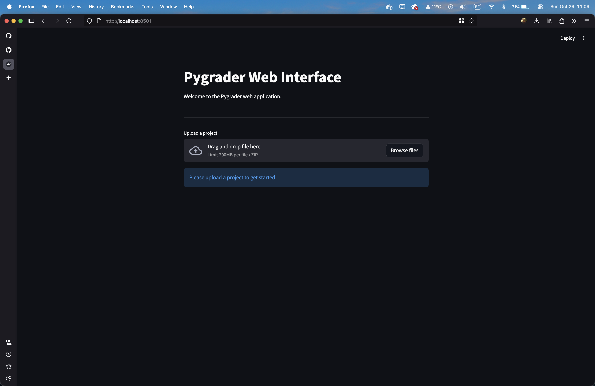
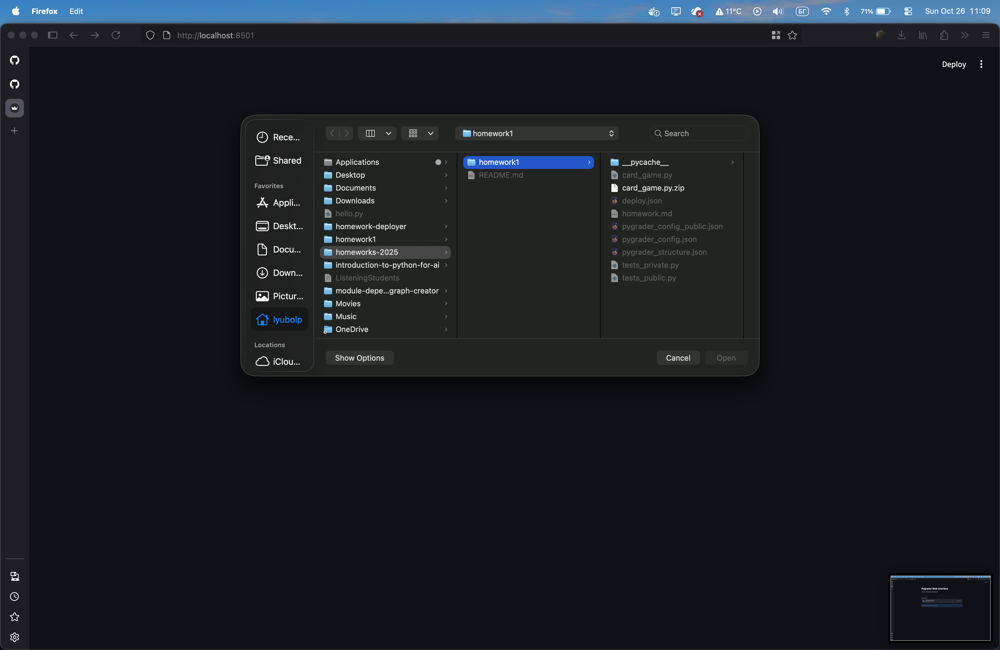
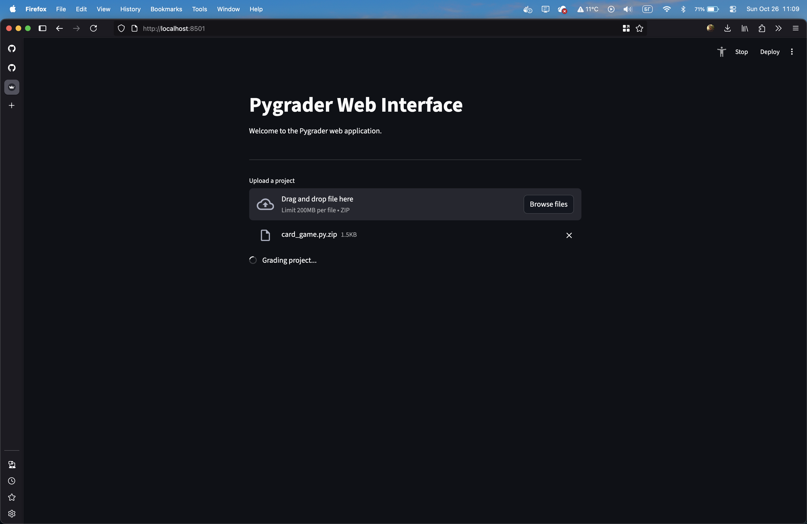
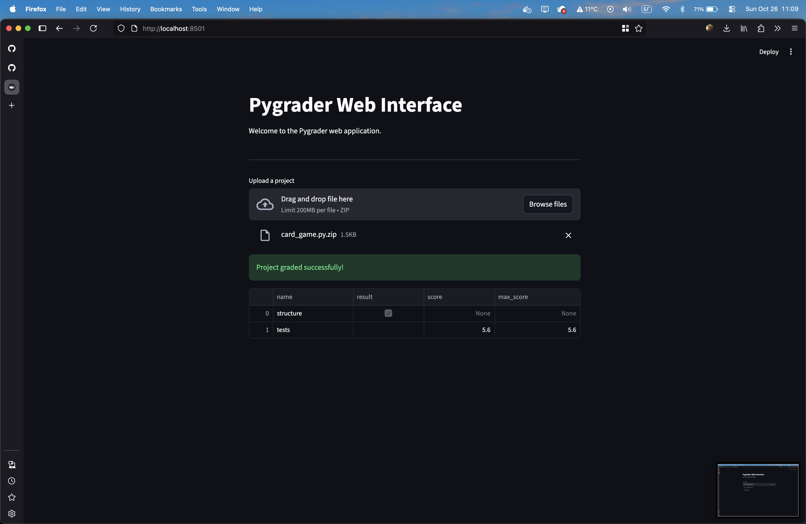
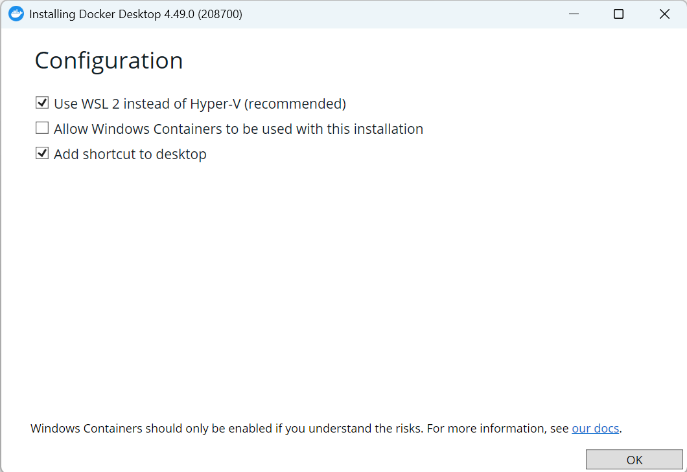
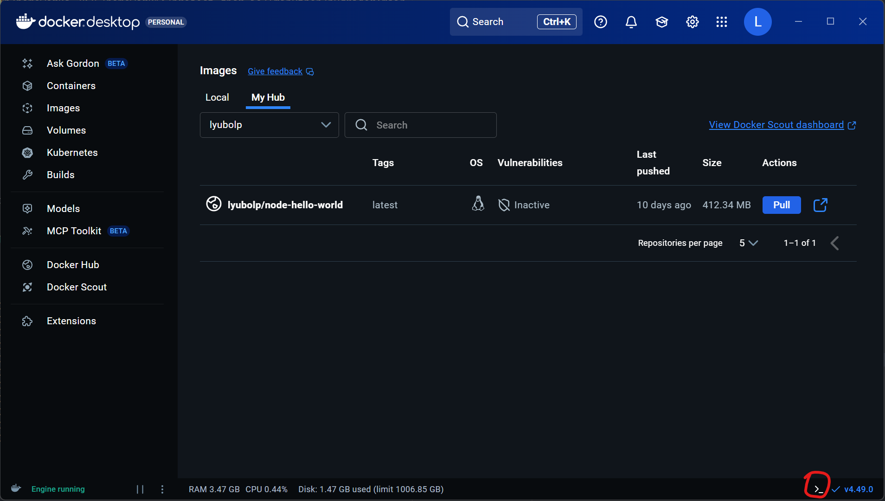

# Как да си пуснем pygrader при нас ?

Първото важно нещо е, че **изпълнението на pygrader-а от вас не е задължително условие** за да бъдат оценени домашните ви.

Предоставяме ви възможност да тествате решението си върху част от тестовете, с цел да проверите дали сте в правилната посока.
Крайните точки за всяко от домашните ще бъдат получавани след като преподавателския екип изпълни pygrader-а върху това което сте качили в Moodle. 

Предоставяме три варианта за изпълнение на pygrader-а:

1. pygrader-web - уеб-базиран вариант. Не изисква инсталация на допълнителни програми на вашия компютър. Възможно е да има нестабилност при завишено използване.
2. pygrader Docker image - Docker image на pygrader-а. Изисква инсталаия на Docker на вашия компютър. Най-сигурният вариант.
3. pygrader source - директно изпълнение на pygrader-а. Изисква сваляне на кода и конфигуриране. 

## pygrader-web

На **LINK** е качен уеб версия на pygrader-а. За неговото използване не трябва да инсталирате нищо на вашата машина.

За да тествате решението си, трябва просто да го качите като .zip архив.

### Стъпка 1

Отворете link



### Стъпка 2

Чрез бутона "Browse files" качете архива с вашето решение.
**Важно: Приемат се само zip архиви.**



### Стъпка 3

Изчакайте докато pygrader-а прегледа вашето решение.




### Стъпка 4

Разгледайте резултатите за вашето решение.



## pygrader Docker package

Docker е технология, която позволява създаването и изпълнението на т.нар. "контейнери".

Единственото, което трябва да имате инсталирано на вашия компютър е Docker Desktop.
TODO - Add link.

След като сте свалили Docker Desktop, следвайте следните инструкции, спрямо вашата ОС.

**Важно** При инсталация на Windows оставете следните настройки включени:



### Docker desktop

#### Стъпка 1

Отворете Docker Desktop.

#### Стъпка 2

В долният-десен ъгъл е иконката за терминал.



#### Стъпка 3

От тук следвате стъпките в секцията по-долу, "Терминал".

### Терминал

Изпълнете следните две команди, една след друга:

```bash
docker pull ghcr.io/fmipython/pygrader:main
docker run --rm -v /home/lyubolp/homeworks-2025/homework1:/project ghcr.io/fmipython/pygrader:main
```

```bash
Python project grader, 1.5.0
Check: structure, Result: True
Check: tests, Score: 5.6/5.6
```

```bash
Python project grader, 1.5.0
Check: structure, Result: True
Check: tests, Score: 5.4/5.6
```

Ако искате да видите повече информация за резултатите от проверките, може да изпълните командата за изпълнение на контейнера с аргумент `-v`

```bash
docker run --rm -v /home/lyubolp/homeworks-2025/homework1:/project ghcr.io/fmipython/pygrader:main -v
```

```bash
2025-10-25 13:28:44,951 - INFO - Python project grader, 1.5.0
2025-10-25 13:28:44,952 - VERBOSE - Downloading file from https://api.github.com/repos/fmipython/homeworks-2025/contents/homework1/pygrader_config_public.json
2025-10-25 13:28:45,280 - VERBOSE - Running structure
2025-10-25 13:28:45,280 - VERBOSE - Downloading file from https://api.github.com/repos/fmipython/homeworks-2025/contents/homework1/pygrader_structure.json
2025-10-25 13:28:45,620 - VERBOSE - Is Solution file structure valid ? True
2025-10-25 13:28:45,620 - VERBOSE - Creating new venv
2025-10-25 13:28:47,827 - VERBOSE - Installing grader dependencies
2025-10-25 13:28:50,658 - VERBOSE - Running tests
2025-10-25 13:28:50,658 - VERBOSE - Downloading file from https://api.github.com/repos/fmipython/homeworks-2025/contents/homework1/tests_public.py
2025-10-25 13:28:51,182 - VERBOSE - Test test_07_chips_method - AssertionError: Lists differ: ... failed
2025-10-25 13:28:51,184 - VERBOSE - Passed tests: 38/39
2025-10-25 13:28:51,184 - VERBOSE - Failed tests: 1/39
Check: structure, Result: True
Check: tests, Score: 5.4/5.6
```


## pygrader source

Ако не искате да инсталирате Docker на вашия компютър, може да свалите кодът на pygrader-а, и да го пуснете ръчно.

### Linux & MacOS

### Windows

